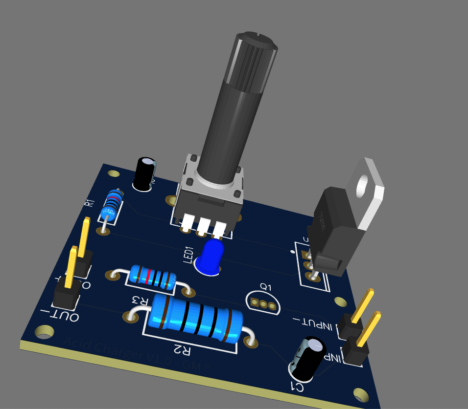
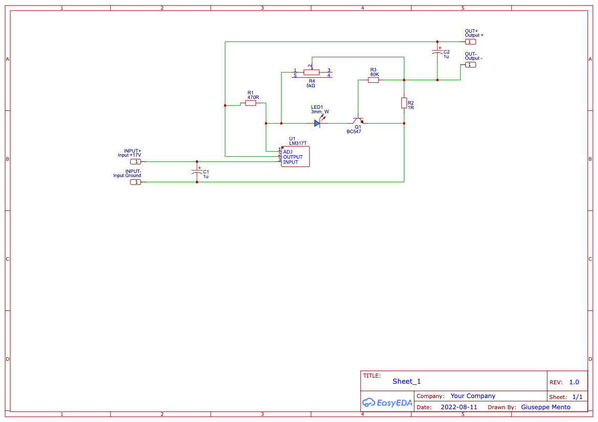

# ACID CHARGER V1

This board is a charger for acid batteries.

## Description

The board is based on the voltage regulator LM317, and it charges any acid battery with a maximum rate of 1.5A

## The board

## Electrical Characteristics

INPUT VOLTAGE (Vin): Range from 15 to 30 V
OUTPUT VOLTAGE (Vout): Vout-Vin < 30 V

The output voltage is regulated by the main potentiometer, 
Do not forget to set the correct charging voltage before loading the battery.

High voltage drops from Vin to Vout may overheat and damage the board please do not exceed (Vin - Vou) > 30V

Please use heat sink on LM317. 

# Charging voltages

| Acid Battery | Voltage    |
| ------------ |------------|
 | 12 V        | 13.7 (max) |
 | 24 V        | 28.8 (max) |

# Schematics

# Disclamer

This project is purely “at your own risk”. If you are uncomfortable or inexperienced please reconsider using this repository.
Electricity is dangerous and severe shocks can be fatal.
